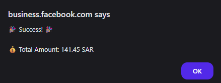

# 💰 Facebook Ads Billing Total Calculator

A simple JavaScript snippet to be run directly in your browser's **Console**, which calculates and sums up all amounts on the **“Transactions”** page of Facebook Ads Manager — especially helpful when amounts are displayed in Arabic numerals.

---

## 🖼️ Preview

> 

---

## 🎯 What problem does this solve?

When reviewing your Facebook Ads bills, you often want to know **how much you’ve spent in total over a certain period**.
Doing this manually is tedious, error-prone, and time-consuming — especially with dozens of transactions.

🔍 This tiny script fully automates that task with a single line, saving you effort and mistakes.

---

## ✨ Features

✅ **Super easy to use** — just copy & paste into the Console.
✅ **Handles Arabic numerals**, like `٢٤٫١٥` and the Arabic decimal `٫`.
✅ **Ignores currency symbols, spaces, invisible characters.**
✅ **Clear output:** shows total in a popup alert and logs it to the Console.
✅ **Open-source:** MIT licensed, tweak as you like.

---

## 🚀 How to use

1. Go to your transactions page in Facebook Ads Manager:
   📍 `https://business.facebook.com/billing_hub/payment_activity`

2. Make sure all transactions you want to sum are **fully loaded on the page** (scroll down to load them).

3. Open your browser’s Developer Tools:

   * On Windows: `F12` or `Ctrl + Shift + I`
   * On Mac: `Cmd + Option + I`

4. Switch to the **Console** tab.

5. 📋 **Copy the entire code below, paste it into the Console, and press Enter.**

6. A popup will show the total amount, and details will also be logged to the Console. ✅

---

## 💻 The Code

```javascript
function calculateFacebookAdsTotal() {
  const amountElements = document.querySelectorAll('td[role="gridcell"][aria-colindex="3"] span');
  if (amountElements.length === 0) {
    alert("😟 No transactions found!\nMake sure the transactions table is fully visible on the page before running the script.");
    return;
  }
  let total = 0;
  amountElements.forEach(element => {
    const textValue = element.textContent;
    const numberPart = textValue.replace(/[^٠-٩٫]/g, '');
    let cleanedText = numberPart.replace(/٫/g, '.').replace(/[٠-٩]/g, d => '٠١٢٣٤٥٦٧٨٩'.indexOf(d));
    const amount = parseFloat(cleanedText);
    if (!isNaN(amount)) total += amount;
  });
  alert(`🎉 Success! 🎉\n\n💰 Total Amount: ${total.toFixed(2)} SAR`);
  console.log(`💰💰💰 Final Total: ${total.toFixed(2)} SAR`);
}
calculateFacebookAdsTotal();
```

---

## 🔗 Useful links

* 📂 [View this code on GitHub](#) *(replace with your repository link once uploaded)*
* 🐛 Found an issue? Open an **Issue**.
* ⭐ Like this project? Give it a **star**!

---

## 🤝 Contributors & Ideas

This project is open to improvements!
Have a great idea like:

* Supporting other currencies (USD, EUR, etc.)
* Copying the total to the clipboard automatically
* Turning this into a browser extension

💌 Feel free to open a **Pull Request** or drop an Issue.

---

## 📄 License

This project is licensed under the [MIT License](LICENSE).
Use it, modify it, and build on it freely.

---

# 💰 حاسبة إجمالي فواتير إعلانات فيسبوك

كود JavaScript بسيط يُستخدم مباشرة داخل **Console المتصفح** لحساب وجمع كل المبالغ في صفحة **"المعاملات"** الخاصة بمدير إعلانات فيسبوك، خاصة عندما تكون الأرقام مكتوبة باللغة العربية.

---

## 🖼️ صورة توضيحية

> 

---

## 🎯 المشكلة التي يحلها الكود

عند مراجعة فواتير إعلاناتك على فيسبوك، ستجد نفسك غالبًا بحاجة لحساب إجمالي ما تم إنفاقه خلال فترة معينة.
القيام بذلك يدويًا مملّ، مضيِّع للوقت، ومعرّض للأخطاء خاصة مع وجود عشرات المعاملات.

🔍 هذا السكريبت الصغير يقوم بأتمتة المهمة بالكامل بنقرة واحدة، ويوفر عليك الجهد والخطأ.

---

## ✨ المميزات

✅ **سهل الاستخدام:** انسخ والصق فقط في الـ Console.
✅ **يدعم الأرقام العربية:** مثل `٢٤٫١٥` ويتعامل مع الفاصلة العربية `٫`.
✅ **يتجاهل الرموز والفراغات والعلامات الخفية.**
✅ **يعرض النتيجة بوضوح** في نافذة منبثقة، ويسجلها في الـ Console.
✅ **مصدر مفتوح** بالكامل، مرخص MIT، ويمكنك تعديله كما تشاء.

---

## 🚀 طريقة الاستخدام

1. اذهب إلى صفحة المعاملات في مدير الإعلانات بفيسبوك:
   📍 `https://business.facebook.com/billing_hub/payment_activity`

2. تأكد من أن جميع المعاملات التي تريد حسابها **محملة في الصفحة** (اسحب للأسفل ليتم تحميلها كلها).

3. افتح أدوات المطور في متصفحك (Developer Tools):

   * في ويندوز: `F12` أو `Ctrl + Shift + I`
   * في ماك: `Cmd + Option + I`

4. اختر تبويب **Console**.

5. 📋 **انسخ الكود أدناه بالكامل والصقه في الـ Console ثم اضغط Enter.**

6. ستظهر لك نافذة منبثقة توضح الإجمالي، وسيتم تسجيل التفاصيل أيضًا في الـ Console. ✅

---

## 💻 الكود

```javascript
function calculateFacebookAdsTotal() {
  const amountElements = document.querySelectorAll('td[role="gridcell"][aria-colindex="3"] span');
  if (amountElements.length === 0) {
    alert("😟 No transactions found!\nMake sure the transactions table is fully visible on the page before running the script.");
    return;
  }
  let total = 0;
  amountElements.forEach(element => {
    const textValue = element.textContent;
    const numberPart = textValue.replace(/[^٠-٩٫]/g, '');
    let cleanedText = numberPart.replace(/٫/g, '.').replace(/[٠-٩]/g, d => '٠١٢٣٤٥٦٧٨٩'.indexOf(d));
    const amount = parseFloat(cleanedText);
    if (!isNaN(amount)) total += amount;
  });
  alert(`🎉 Success! 🎉\n\n💰 Total Amount: ${total.toFixed(2)} SAR`);
  console.log(`💰💰💰 Final Total: ${total.toFixed(2)} SAR`);
}
calculateFacebookAdsTotal();
```

---

## 🔗 روابط مفيدة

* 📂 [الكود على GitHub](#) *(استبدله برابط مستودعك عند رفعه)*
* 🐛 افتح **Issue** لو واجهتك مشكلة.
* 🌟 ضع نجمة ⭐️ للمستودع لو أعجبك المشروع.

---

## 🤝 المساهمون

هذا المشروع مفتوح لأي تحسينات أو إضافات!
إذا كان لديك فكرة رائعة مثل:

* دعم عملات أخرى (USD, EUR)
* نسخ الناتج تلقائيًا إلى Clipboard
* أو حتى تحويله إلى إضافة متصفح

💌 لا تتردد بفتح **Pull Request**.

---

## 📄 الترخيص

هذا المشروع مفتوح المصدر ومرخص تحت [MIT License](LICENSE)، مما يعني أنه بإمكانك استخدامه وتعديله بحرية تامة.
